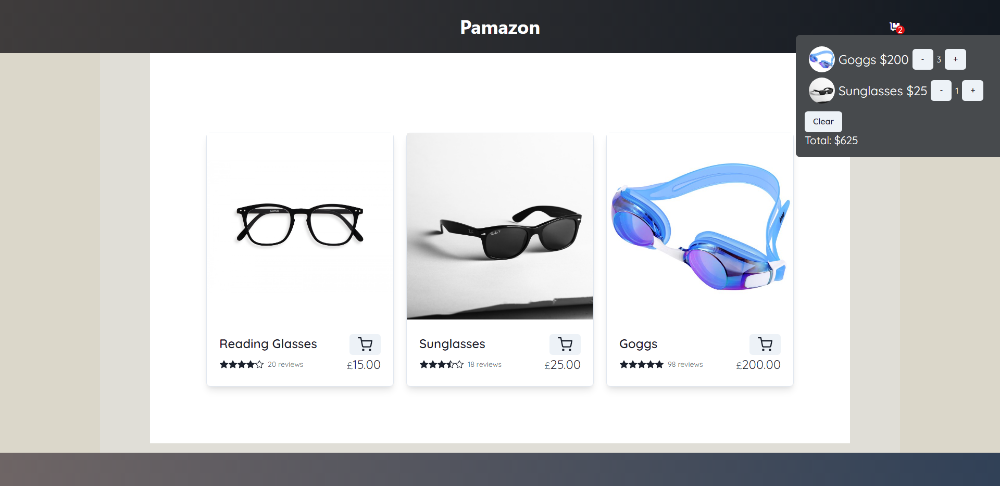

# demo-shop-app

Live [here](https://mock-storefront.herokuapp.com)

This is a small ecommerce shop project I made using React, Redux, Node.js, and Express.
A User can add various products/quanties to a responsive shopping cart that 
Redux was used for the global state managment of the shopping cart. 

# Home Page

